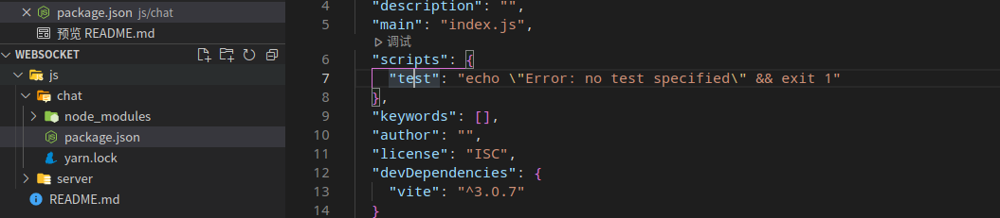

# websocket
1. open
2. close
3. error
4. message
5. connection

# 前端
1. open
2. close
3. error
4. message

cd chat 
npm init -y
yarn add vite -D

cd server 
yarn add ws

</img>

  "scripts": {
    "dev": "vite"
  },

启动
1. cd js/chat 
2. npm i 
3. npm run dev

1. cd js/server
2. npm i
3. npm run dev

如果run dev报错 nodemon: not found
1. npm uninstall nodemon
2. sudo npm install -g --force nodemon